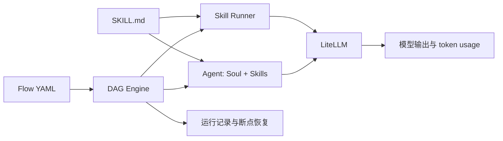

# SoloFlow

> 文件驱动的 AI Skill、Agent 与 LLM 工作流编排工具。

[](https://github.com/halexzd686-cloud/SoloFlow/actions/workflows/ci.yml)
[](https://www.python.org/)
[](LICENSE)
[](STATUS.md)

SoloFlow 把提示词和专家经验保存为可版本控制的 `SKILL.md`，再通过 Agent 组合角色，通过 Flow 把多个步骤编排成可恢复的 DAG。所有核心资产都是普通文本文件，适合本地使用、团队协作和 Git 分享。

当前版本为 `1.0.0rc4`。本地 248 项测试、GitHub Actions 跨平台矩阵、wheel 构建、干净环境安装 smoke、DeepSeek Skill/Agent/Flow 实调、Claude Code MCP 实连、远程 Registry publish/PR/install，以及 Heartbeat 故障注入与真实环境加速 soak 均已通过；其他 LLM 供应商仍待最终确认，详见[项目状态](STATUS.md)。

## 它解决什么问题

| 问题 | SoloFlow 的做法 |
| --- | --- |
| 提示词散落在聊天记录和项目配置中 | 用 `SKILL.md` 形成可复用、可审查的专家资产 |
| 一个复杂任务需要多轮手工衔接 | 用 YAML Flow 定义依赖、输入、并发和输出 |
| 角色设定与技能配置互相混杂 | Agent 组合 Soul 人格、多个 Skill 和模型覆盖配置 |
| 中途失败只能从头开始 | 保存运行状态并通过 `sf flow resume` 恢复 |
| 不同模型 SDK 使用方式不一致 | 通过 LiteLLM 使用统一调用层 |

## 核心模型



## 安装

SoloFlow 尚未发布到 PyPI。当前请从源码安装：

```bash
git clone https://github.com/halexzd686-cloud/SoloFlow.git
cd SoloFlow
uv sync --extra dev
uv run sf version
```

要求 Python 3.12 或 3.13。也可以构建并安装 wheel：

```bash
uv build
uv pip install dist/soloflow-*.whl
```

完整安装说明见[快速开始](docs/quickstart.md)。

## 五分钟体验

查看安装包自带的资产：

```bash
uv run sf skill list
uv run sf agent list
uv run sf flow list
```

无需 API Key 即可预览 Skill Prompt 和 Flow 执行计划：

```bash
uv run sf skill run content-writer "AI Agent 落地" --dry-run
uv run sf flow run blog-pipeline -i topic="AI Agent 落地" --dry-run
```

配置模型供应商的环境变量后运行真实任务，例如：

```powershell
$env:DEEPSEEK_API_KEY = "<your-key>"
uv run sf skill run content-writer "AI Agent 落地"
```

也可以复制 `.env.example` 为当前工作目录下的 `.env` 并填写实际使用的供应商。SoloFlow 只读取当前目录的 `.env`，不会向父目录搜索，也不会覆盖系统或 Shell 已设置的环境变量。

不要把 API Key 写入 Skill、Flow、MCP 配置或提交到 Git；`.env` 已默认加入忽略规则。

## 主要能力

- Skill：创建、校验、列表、执行、多版本生成和自动迭代。
- Agent：Soul 人格、多个 Skill、配置继承与 Heartbeat 调度。
- Flow：DAG 校验、变量引用、分层并发、失败跳过、超时重试、输出映射和断点恢复。
- Registry：离线索引、Git 拉取、版本安装、打包发布和可选 PR 提交。
- MCP：JSON-RPC 2.0 over stdio，提供 9 个 Skill、Agent、Flow 工具。
- TUI：终端仪表盘、详情弹窗、动态输入和运行恢复。

安装包内置：

- 4 个 Skill：`content-writer`、`code-reviewer`、`market-researcher`、`hello-world`
- 2 个 Agent：`content-editor`、`code-guardian`
- 8 个 Flow：blog、代码审查、竞品分析、内容营销、会议纪要、入职文档、发布说明和周报

项目目录或 `~/.soloflow` 中的同名资产会覆盖安装包默认资产。

## 能力边界

SoloFlow 是 Prompt 与 LLM 工作流编排工具，不是完整的自主 Agent 平台：

- Runner 不会自动获得浏览器、搜索、文件系统或其他工具。
- Agent 没有自主规划循环、长期记忆和后台分布式执行能力。
- Flow 步骤主要传递字符串输出，暂不支持条件节点、人工审批和 fallback model。
- Registry 暂无签名、checksum 和 commit SHA lockfile。
- Heartbeat 已通过单机加速稳定性验收；跨机器、跨网络环境的长期运行仍需社区反馈。

## MCP 接入

启动 stdio Server：

```bash
uv run sf mcp
```

客户端配置示例见 [mcp-config.example.json](mcp-config.example.json)，安全配置和工具列表见 [MCP 文档](docs/mcp.md)。

## 项目结构

```text
SoloFlow/
├── agents/                 # Agent 示例源码
├── flows/                  # Flow 示例源码
├── skills/                 # Skill 示例源码
├── soloflow/               # Python 包
├── tests/                  # 自动化测试
├── docs/                   # 用户与架构文档
├── .github/workflows/      # CI 与 Release
├── pyproject.toml
└── uv.lock
```

顶层 `skills/`、`agents/`、`flows/` 是内置资产的唯一源码；构建 wheel 时会映射到包内资源目录。

## 开发与验证

```bash
uv sync --extra dev
uv run pytest -q
uv run ruff check soloflow tests
uv run ruff format --check soloflow tests
uv build
```

当前本地基线：248 项测试通过，65 个 Python 文件格式检查通过。远程 Windows/Linux × Python 3.12/3.13 矩阵和 Ubuntu clean-wheel smoke 已通过；最新结果以 GitHub Actions 页面为准。

## Roadmap

- [x] Skill、Agent、Flow、TUI、MCP 和本地 Registry 基础能力
- [x] Flow 并发、失败传播、运行持久化和恢复
- [x] wheel 内置资产与源码目录外安装 smoke
- [x] DeepSeek 真实 Skill、Agent、Flow 端到端与 token usage 验证
- [ ] OpenAI、Anthropic 等其他 LLM 供应商端到端验证
- [x] Claude Code 真实 MCP 客户端连接与工具调用验证
- [x] 远程社区 Registry update、search、版本校验与 install
- [x] 远程社区 Registry publish/PR 闭环
- [x] Heartbeat daemon 启停、探活、中断恢复与 PID 清理
- [x] Heartbeat 双 Agent 并发真实 LLM 触发与状态持久化
- [x] Heartbeat PID 复用识别与无关进程保护
- [x] Heartbeat 500 周期超时、连接、限流和空响应故障注入
- [x] Heartbeat 67 分钟真实 DeepSeek 加速稳定性验收（33/33 次成功）
- [ ] `v1.0.0` 与 PyPI 发布

## 参与项目

提交问题或代码前请阅读 [CONTRIBUTING.md](CONTRIBUTING.md)。安全问题请按照 [SECURITY.md](SECURITY.md) 私下报告。版本变化记录在 [CHANGELOG.md](CHANGELOG.md)。

## License

[MIT License](LICENSE)
