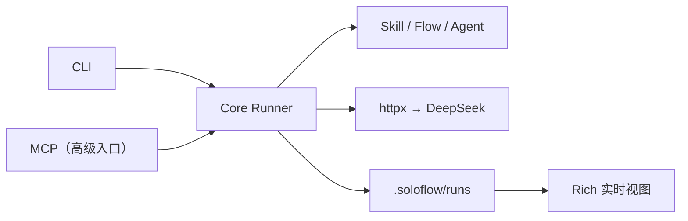

# Architecture

SoloFlow v2 只保留一条核心路径：加载文件资产，渲染 Prompt，调用 DeepSeek，保存结果。



## 三种资产

- Skill：包含模型配置、Prompt 和规则的 `SKILL.md`。
- Flow：描述步骤依赖和输入输出映射的 `*.flow.yml`。
- Agent：组合人格、规则和 Skill 的 `*.agent.yml`。

三者共用同一套发现顺序：

```text
当前项目 → ~/.soloflow/ → 安装包内置资产
```

同名资产以前者为准。发现逻辑只存在于 `core/assets.py`。

## 执行路径

`core/runner.py` 负责加载资产、拼装 Prompt 和调用 LLM。Agent 与 Flow 复用同一执行函数，不各自实现模型调用。

Flow 在执行前校验 DAG，再按拓扑层运行步骤；没有依赖关系的步骤可并行。每一步完成后写入 `.soloflow/runs/<run-id>.json`，用于实时展示和失败恢复。

## LLM 边界

LLM 客户端使用 `httpx` 请求 OpenAI 兼容接口，不引入 provider 基类或注册机制。配置保留 `base_url`、`api_key_env` 和 `model` 三个字段，但当前白名单只允许 `deepseek/deepseek-v4-flash`；其他目标在读取密钥前被拒绝。

## 展示与协议

CLI 使用 Rich 读取运行状态并展示进度，不拥有业务逻辑。MCP 是独立的高级入口，调用相同 Core API，不形成第二套执行路径。

## 信任边界

- API Key 只来自当前目录 `.env` 或进程环境变量。
- Skill、Flow 和 Agent 是本地文本输入，不自动获得文件系统、浏览器或搜索权限。
- 模型输出可能包含错误，涉及事实和决策时必须人工复核。
