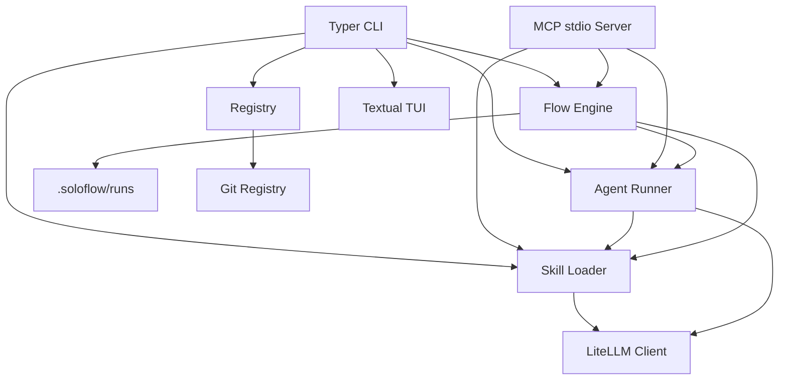

# Architecture

SoloFlow 使用文件作为配置、共享和版本控制边界。



## Asset precedence

```text
Project assets
→ user assets under ~/.soloflow or project .soloflow
→ assets bundled in the wheel
```

同名项目资产覆盖默认资产，让安装包可以开箱体验，同时允许仓库精确控制自己的工作流。

## Flow execution

Flow 引擎先验证 DAG 和输入 schema，再进行拓扑分层。同一层的非流式步骤通过 `asyncio` 和线程桥接并发调用，同一个 semaphore 控制最大并行数。依赖步骤只有全部完成才可执行；失败或跳过状态会沿依赖链传播，独立分支可以继续。

流式模式为了避免多个同步生成器交错输出，会规范化为串行执行。

每一步结束后更新运行记录；resume 复用原 run ID、已完成输出、耗时和 token 统计。

## Trust boundaries

- 模型凭据来自环境变量，不应写入 Skill。
- MCP 提供 token 和工具白名单，但仍应由客户端限制可调用范围。
- Registry 内容属于外部输入；当前大小和结构校验不能替代签名验证。
- Skill 和 Flow 主要生成 Prompt，不自动授予文件系统或网络能力。
