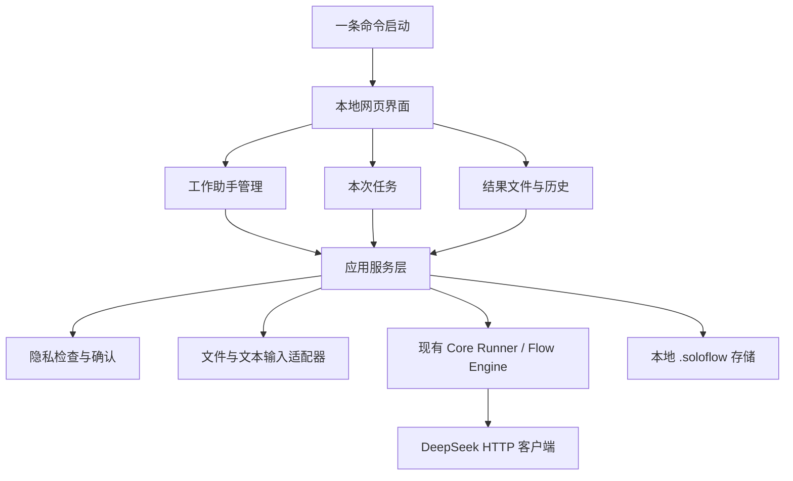

# SoloFlow MVP 重构清单

> 基线：当前 `main` / `dev` 已完成的 SoloFlow v2 CLI 核心
>
> 目标：在保留稳定执行核心的前提下，增加面向普通用户的本地网页产品层

## 1. 当前实现与目标形态的差距

| 领域 | 当前实现 | MVP 目标 |
| --- | --- | --- |
| 入口 | CLI 为主，MCP 为高级入口 | 本地网页为唯一用户入口；CLI 只负责启动 |
| 用户对象 | 了解命令和工作手册的用户 | 不懂 AI 的公司员工 |
| 任务定义 | Playbook、Flow、Agent 文件 | 网页中的“工作助手” |
| 创建方式 | 手写 Markdown/YAML 资产 | 自然语言生成草稿 + 表单确认 |
| 输入 | 文本和已有资产参数 | 文字、粘贴内容和本地文件 |
| 输出 | 文本和运行记录 | 可预览、可修改、可下载的结果文件 |
| 数据保护 | 本地运行记录和 API Key 环境变量 | 本地保存 + 每次 DeepSeek 请求前隐私确认 |
| 复用 | 复制项目资产 | 导出助手包，导入为个人副本 |
| 运行 | CLI 手动运行 Flow/Playbook | 网页手动运行工作助手 |

## 2. 建议的产品层架构



核心原则：网页只负责交互和状态展示，模型调用、工作步骤执行、隐私门禁和文件保存应由应用服务层统一编排。现有 Runner 和 DeepSeek HTTP 客户端继续作为底层能力，不在网页层重复实现模型调用。

## 3. 本地数据布局建议

```text
.soloflow/
├── config/
│   └── settings.json              # 非敏感界面设置和模型偏好
├── assistants/
│   └── <assistant-id>/
│       ├── assistant.json         # 工作助手当前版本
│       ├── versions/              # 历史版本
│       └── exports/               # 用户主动导出的助手包
├── runs/
│   └── <run-id>/
│       ├── run.json               # 状态、输入摘要、模型和版本信息
│       ├── inputs/                # 用户输入的本地副本
│       ├── redacted/              # 用户确认后的脱敏副本
│       └── artifacts/             # 生成文件
└── logs/
    └── app.log
```

API Key 不应写入助手包、运行记录或普通导出日志。具体的本机密钥存储方式应在安全设计阶段单独确定，并避免在网页响应和错误日志中回显。

## 4. 领域对象建议

### 4.1 Assistant

- `id`
- `name`
- `description`
- `goal`
- `input_schema`
- `steps`
- `output_spec`
- `rules`
- `default_model`
- `current_version`
- `created_at` / `updated_at`

### 4.2 AssistantVersion

- `assistant_id`
- `version`
- `definition`
- `change_note`
- `created_at`
- `source`：创建、用户确认修改、导入

### 4.3 Run

- `id`
- `assistant_id` / `assistant_version`
- `model`
- `status`
- `input_files`
- `privacy_status`
- `steps`
- `artifact_ids`
- `created_at` / `completed_at`

### 4.4 Artifact

- `id`
- `run_id`
- `name`
- `media_type`
- `path`
- `size`
- `preview_status`

## 5. Web MVP 页面与流程

### 5.1 页面

- 首页：示例助手、我的助手、最近结果
- 创建助手：自然语言输入、自动生成的确认表单、试运行
- 助手详情：说明、版本、运行、编辑、导出
- 运行页面：输入材料、临时要求、模型选择、隐私确认
- 隐私检查页：风险提示、建议脱敏、重新上传、确认发送
- 结果页面：预览、继续修改、版本对比、单文件下载、ZIP 下载
- 设置页面：DeepSeek API Key、模型列表、本地数据管理

### 5.2 主要接口方向

接口名称可以在实现时调整，功能边界建议先固定：

- `GET /api/assistants`
- `POST /api/assistants/draft`
- `POST /api/assistants/{id}/trial`
- `POST /api/assistants/{id}/versions`
- `POST /api/assistants/{id}/export`
- `POST /api/assistants/import`
- `POST /api/runs`
- `POST /api/runs/{id}/privacy/confirm`
- `POST /api/runs/{id}/revise`
- `GET /api/runs/{id}/artifacts/{artifact_id}/download`
- `GET /api/runs/{id}/artifacts/download.zip`

这些接口只服务本机网页，不设计成公开远程服务。

## 6. 分阶段实施顺序

### P0：产品层骨架

- 选择轻量本地 Web 技术栈，避免引入不必要的远程服务
- 添加一条命令启动本地服务并打开浏览器
- 建立应用服务层，不让网页直接调用 LLM 客户端
- 创建本地目录和基础设置页
- 配置 DeepSeek API Key、连接测试和模型列表

### P1：工作助手闭环

- Assistant 数据模型和本地 CRUD
- 首页和示例助手
- 自然语言生成助手草稿
- 草稿表单确认
- 试运行和预览
- 保存工作助手及版本
- 手动运行助手

### P2：文件、隐私和交付

- `.docx`、`.xlsx`、`.csv`、`.pdf`、`.txt`、`.md` 输入适配
- 图片输入暂缓，等待 DeepSeek 官方 API 提供视觉模型
- 本地敏感信息风险提示
- 脱敏副本和原始文件隔离
- 发送前确认门禁
- 结果预览、自然语言修改和版本保留
- 单文件下载及 ZIP 打包下载

### P3：分享和历史管理

- 工作助手导出包
- 导入后创建个人副本
- 导出包内容校验
- 历史运行查看和删除
- 助手版本恢复、复制和重新导出

### P4：稳定性与发布

- Windows PowerShell 启动验收
- 中文输出统一 UTF-8
- 无 API Key 时的清晰引导
- 图片入口关闭后的清晰提示
- 错误恢复与失败重试提示
- 真实 DeepSeek 请求验收
- 完整更新 README、教程、状态和安全文档

## 7. 测试要求

### 单元测试

- 工作助手定义解析和版本生成
- 输入文件类型识别
- 图片能力重新开放前的模型能力验证
- 敏感信息建议逻辑
- 脱敏副本不覆盖原文件
- 未确认隐私时不得调用 DeepSeek
- 导出包不包含 API Key、运行记录和源文件
- 多文件结果打包

### 集成测试

- 启动本地网页并完成首次配置
- 自然语言创建助手、表单确认、试运行和保存
- 手动运行、隐私确认、生成结果和下载
- 当前运行修改不改变助手版本
- 确认长期修改后生成新版本
- 导出并导入为个人副本

### 人工验收

- Windows 终端复制一条命令即可进入网页
- 不懂技术的用户可以只看懂“工作助手、上传材料、生成结果、下载文件”
- 任何发送给 DeepSeek 的内容都有可见提示
- 结果文件可打开，多个文件可分别下载和打包下载

## 8. 风险与取舍

| 风险 | 处理方式 |
| --- | --- |
| 本地网页仍需要用户复制命令 | 启动命令保持单行，自动检查环境并提供普通语言提示 |
| DeepSeek 官方 API 当前为纯文本模型 | 暂时关闭图片入口，待官方视觉模型可用后重新评估 |
| 敏感信息检测不可能完美 | 明确这是风险提示，保留用户确认和手动脱敏入口 |
| 生成文件格式复杂 | 先支持常见格式，采用独立 Artifact 层，后续增加导出器 |
| 工作助手定义过于自由导致质量不稳定 | 强制草稿确认和试运行，长期修改必须显式确认 |
| 过早加入多人协作导致复杂度上升 | MVP 只做导出、导入和个人副本 |
| 现有 CLI 资产与新网页概念不一致 | 保留内部兼容层，逐步将 Playbook/Flow/Agent 映射为工作助手能力 |

## 9. 完成标准

当一个不懂 AI 的普通员工能够在不阅读技术文档的情况下，完成“创建周报助手、上传本周材料、确认隐私、生成并下载周报、修改后保存新版本、导出给同事”这一完整流程，SoloFlow MVP 才算达到产品目标。
